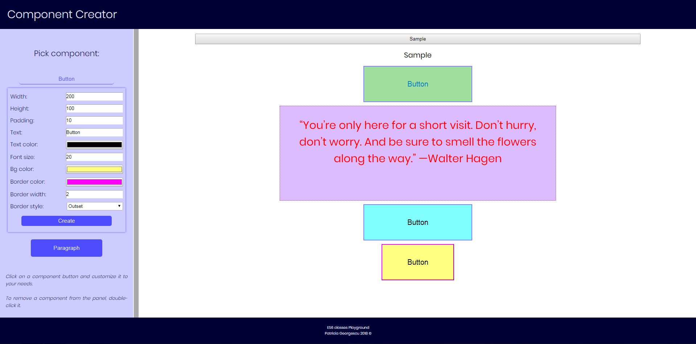

## Synopsis

This is an interface I created to play around with the ES6 classes.

You can create different "components" and customize them however you like.

This was done using:

* HTML
* CSS
* JavaScript

## Live Demo

To see the live demo, please [click here](https://patriciageo3.github.io/component-creator/).

## Authors

Patricia Georgescu

## Quick Live Preview
